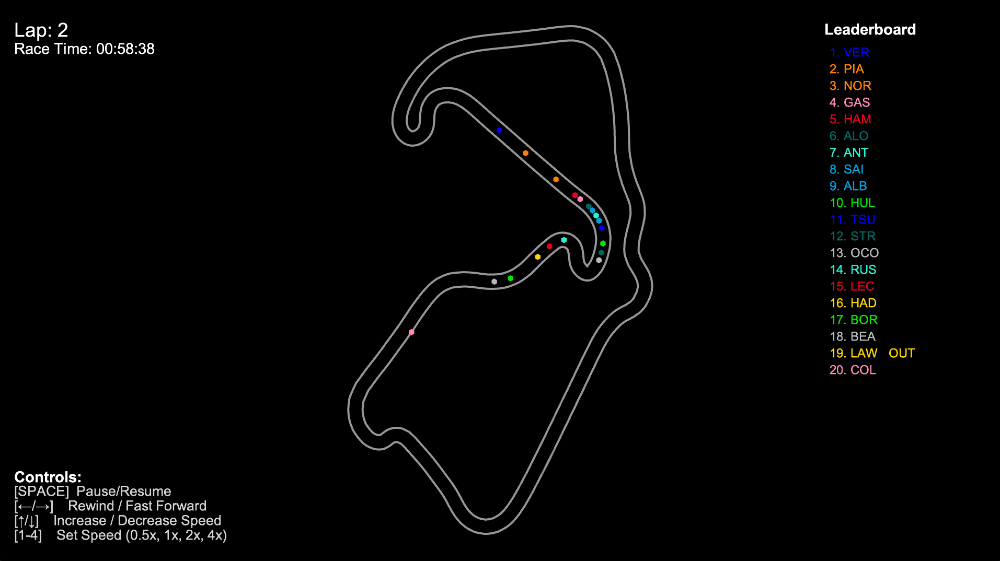

# F1 Race Replay 🏎️ 🏁

A Python application for visualizing Formula 1 race telemetry and replaying race events with interactive controls and a graphical interface.



## Features

- **Race Replay Visualization:** Watch the race unfold with real-time driver positions on a rendered track.
- **Enhanced Leaderboard:** See live driver positions with **time gaps** between positions (e.g., "+1.234s").
- **Speed Visualization:** Cars are color-coded by speed (red=fast, blue=slow) for instant visual feedback.
- **Follow Camera Mode:** Follow any driver with camera that automatically tracks their position.
- **Timeline Scrubber:** Click anywhere on the timeline to jump to a specific moment in the race.
- **Driver Labels:** See driver abbreviations above each car (toggleable).
- **Speed Display:** Show speed values above cars (toggleable).
- **Multiple Session Types:** Support for Race, Qualifying, and Practice sessions.
- **Lap & Time Display:** Track the current lap and total race time.
- **Driver Status:** Drivers who retire or go out are marked as "OUT" on the leaderboard.
- **Interactive Controls:** Comprehensive keyboard controls for all features.
- **Better Car Graphics:** Cars are rendered as rectangles that rotate based on track direction.

## Controls

### Playback Controls
- **Pause/Resume:** `SPACE`
- **Rewind/Fast Forward:** `←` / `→` (10 frames at a time)
- **Playback Speed:** `↑` / `↓` (multiply/divide by 2)
- **Set Speed Directly:** `1` (0.5x), `2` (1x), `3` (2x), `4` (4x)
- **Timeline Scrubber:** Click anywhere on the timeline bar at the bottom to jump to that time

### Camera Controls
- **Follow Leader:** `F` (toggles follow camera mode, follows current leader)
- **Follow by Position:** `5-9` (follow driver at position 5-9)

### Display Toggles
- **Toggle Speed Display:** `S` (show/hide speed values above cars)
- **Toggle Driver Labels:** `L` (show/hide driver abbreviations above cars)

All controls are also shown in the on-screen legend during replay.

## Requirements

- Python 3.8+
- [FastF1](https://github.com/theOehrly/Fast-F1)
- [Arcade](https://api.arcade.academy/en/latest/)
- numpy

Install dependencies:
```bash
pip install -r requirements.txt
```

## Usage

### Basic Usage

Run the main script and specify the year and round:
```bash
python main.py --year 2025 --round 12
```

### Command-Line Options

```bash
python main.py --help  # Show all available options
```

**Available Options:**
- `--year YEAR` - Year of the race (default: 2025)
- `--round ROUND` - Round number of the race (default: 12)
- `--session-type TYPE` - Session type: `R` (Race), `Q` (Qualifying), `FP1`, `FP2`, `FP3` (Practice) (default: R)
- `--playback-speed SPEED` - Initial playback speed multiplier (default: 1.0)
- `--refresh-data` - Force re-computation of telemetry data (ignore cached data)

### Examples

```bash
# Watch a specific race
python main.py --year 2024 --round 5

# Watch Qualifying session
python main.py --year 2024 --round 5 --session-type Q

# Watch Practice session with faster initial playback
python main.py --year 2024 --round 5 --session-type FP1 --playback-speed 2.0

# Force refresh of cached data
python main.py --year 2024 --round 5 --refresh-data
```

### Data Caching

The application automatically caches telemetry data in the `computed_data/` directory. This means:
- First run: Downloads and processes data (may take a few minutes)
- Subsequent runs: Loads instantly from cache
- To refresh: Use `--refresh-data` flag to force re-computation

## New Features in Detail

### 🎯 Gap Calculations
Time gaps between positions are calculated and displayed in the leaderboard:
- Shows gap to car ahead (e.g., "+1.234s")
- Leader shows "---" (no gap)
- Gaps update in real-time as positions change

### 🚗 Speed Visualization
Cars are dynamically colored based on their current speed:
- **Red/Orange:** High speed (200-350 km/h)
- **Yellow/Green:** Medium speed (100-200 km/h)
- **Blue:** Low speed (0-100 km/h)
- Colors blend with driver team colors for better visibility

### 📹 Follow Camera Mode
Focus on any driver's perspective:
- Press `F` to toggle following the current leader
- Press `5-9` to follow the driver at that position
- Camera smoothly tracks the selected driver
- Press `F` again to return to overview mode

### 📊 Timeline Scrubber
Navigate through the race easily:
- Visual timeline bar at the bottom of the screen
- Shows current playback position
- Click anywhere to jump to that moment
- Perfect for reviewing specific incidents or battles

### 🏷️ Enhanced Display Options
- **Driver Labels:** See driver codes above each car (toggle with `L`)
- **Speed Display:** Show speed in km/h above each car (toggle with `S`)
- **Playback Speed Indicator:** See current playback speed in the HUD

### 🎮 Improved Car Graphics
- Cars rendered as rectangles instead of circles
- Cars rotate to match track direction
- Better visual representation of car orientation

## File Structure

- `main.py` — Entry point with argparse command-line interface, handles session loading and starts the replay.
- `src/f1_data.py` — Telemetry loading, processing, frame generation, and gap calculations.
- `src/arcade_replay.py` — Visualization engine with all UI features, camera controls, and interactive elements.

## Customization

- Change track width, colors, and UI layout in `src/arcade_replay.py`.
- Adjust telemetry processing in `src/f1_data.py`.

## Contributing

- Open pull requests for UI improvements or new features.
- Report issues on GitHub.

## Technical Details

- **Frame Rate:** 25 FPS (telemetry resampled to common timeline)
- **Data Format:** JSON files cached in `computed_data/` directory
- **Backward Compatibility:** Works with old cached data files (gracefully handles missing speed/gap data)
- **Error Handling:** Improved error messages and validation for better user experience

## Known Issues

- Occasional telemetry data gaps may cause minor accuracy issues with the leaderboard
- First-time data download requires internet connection and may take several minutes
- Very old cached data files may not include speed and gap information (use `--refresh-data` to regenerate)

## 📝 License

This project is licensed under the MIT License.

## ⚠️ Disclaimer

No copyright infringement intended. Formula 1 and related trademarks are the property of their respective owners. All data used is sourced from publicly available APIs and is used for educational and non-commercial purposes only.

